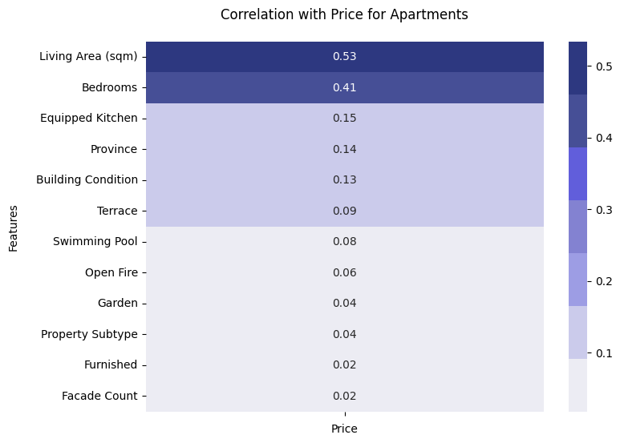
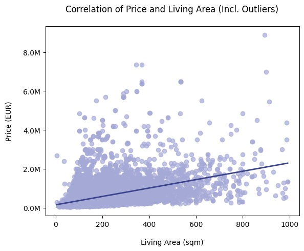
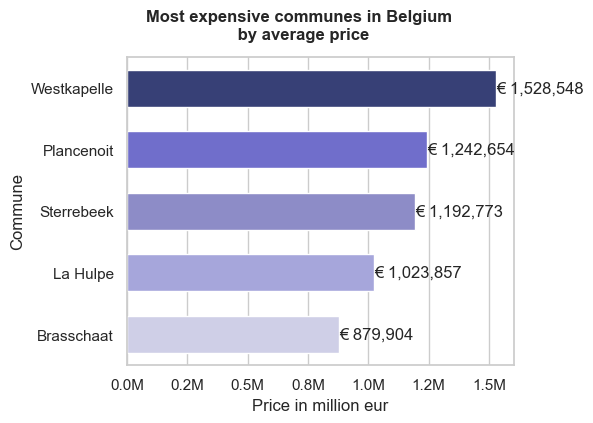

# ImmoEliza Real Estate Project
***Part 2: Data Analysis***

## Description

The ImmoEliza Real Estate Project focuses on analyzing and preparing real estate data to build a predictive machine-learning model for property valuation in Belgium. This phase involves:

* Data Cleaning: Removing duplicates, handling missing values, and correcting errors.

* Data Preprocessing and Analysis: Exploring correlations, identifying key variables, and gaining insights through visualization.

* Data Interpretation: Summarizing findings to make strategic decisions for real estate investments.
The analysis highlights property trends, influential factors on pricing, and regional comparisons across Belgium, Wallonia, and Flanders. The results can be found in the presentation of findings in `/presentation/immo-eliza_analysis.pptx`.

The dataset `raw_data.csv` stems from phase 1 of the ImmoEliza project. The repository for the data scraping can be found under https://github.com/BeatrizJover/Immo-Eliza-project.

## Installation

1. **Clone the repository**

    ```python
    git clone https://github.com/Alkszo/immo_eliza_analysis.git
    ```

2. **Navigate to the repository directory:**

    ```python
    cd <filepath>/immo_eliza_analysis
    ```

3. **Install required dependencies:**

    ```python
    pip install -r requirements.txt
    ```

    Ensure Python 3.8+ is installed. Libraries used include `pandas`, `matplotlib`, `seaborn`, and `numpy`.

4. **Check Input and Output Directory**

    * Ensure that `raw_data.csv` and `cleaned-data.csv`

## Project File Structure

```plaintext
    immo_eliza_analysis/
    ├── graphs/
    ├── notebooks/
    │   ├── Alek-notebook.ipynb
    │   ├── Celina-notebook.ipynb
    │   └── Miriam-notebook.ipynb
    ├── presentation/
    │   └── immo-eliza_analysis.pptx
    ├── README.md
    ├── cleaned-data.csv
    ├── data-cleaning.ipynb
    ├── raw_data.csv
    └── requirements.txt
```

## Usage 

1. **Run the Notebooks**

   * `data_cleaning.ipynb`: Cleans the dataset by removing duplicates and handling missing values and outputs the file `cleaned_data.csv`.
   * `data_analysis.ipynb`: Explores variables, performs data preprocessing and visualizes data trends, and generates graphs showing data distribution and correlation, based on which it identifies key variables and draws insights.
  
2. **Visualizations**
   
   The resulting visualizations can be found in `data_analysis.ipynb` as well as in the `/graphs` folder.
   
   Key charts and graphs include:

   * Plots visualizing outliers
   * Bar charts for pricing across regions and per range of living area in sqm
   * Bar charts for the most and least expensive municipalities in Belgium, Wallonia and Flanders
   * Histogram of property sizes
   * Feature correlation heatmaps

3. **How to Use**
   
    * Launch the notebooks in JupyterLab or your preferred environment.
    * Execute cells sequentially and review visualizations and findings.

## Sample Visualizations










## Contributor Notebooks
The folder `/notebooks` contains one notebook each, showcasing of each contributor. These notebooks are only meant to demonstrate the data exploration, analysis and experimentation process. 

For the final results, please refer to the file `data-analysis.ipynb`.

## Contributors
 * Aleksander Szostakowski
  * Celina Bolanos
  * Miriam Stoehr

## Timeline

**Challenge Duration:** 3 Days

* **Day 1:** Initial dataset review and cleaning
* **Day 2:** Preprocessing and visualization creation
* **Day 3:** Analysis interpretation and documentation

## Personal Situation
The challenge is part of the BeCode Data Science and AI Bootcamp. This phase of the project builds essential skills in data cleaning, preprocessing, and visualization, providing foundational insights to inform later machine learning tasks as well as to develop effective storytelling skills though data. 
